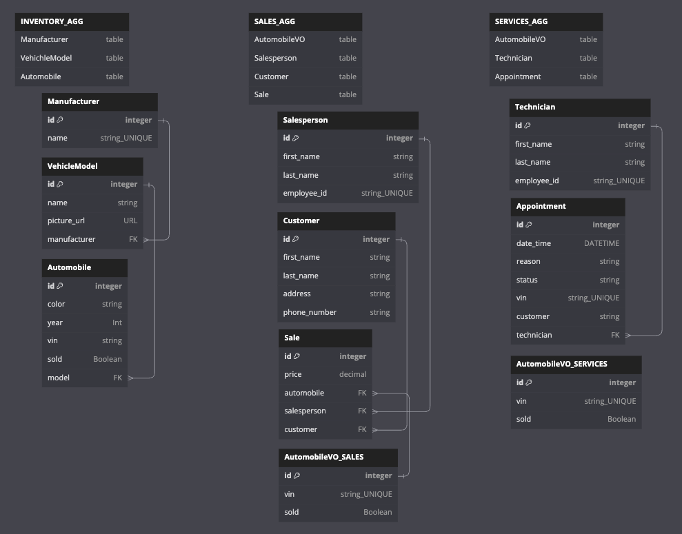

# CarCar
The premiere solution for automobile dealership management!

CarCar is a web application to manage the ins and outs of a automobile dealership. Specifically, it manages inventory, services, and sales.
## Team

* Tim Beckett - Service Microservice
* Eric Warren - Sales Microservice

## Installation
>Note: You need Node.js, git, and Docker installed on your machine.

1. Fork this repository: https://gitlab.com/eswarren18/project-beta.git
2. Clone the repository locally to your machine.
```
git clone https://gitlab.com/eswarren18/project-beta.git
```
3. Build and run the project.
```
docker volume create beta-data
docker-compose build
docker-compose up
```
4. View the project in the browser of your choice at: http://localhost:5173/

## Structure

CarCar is has three interactive microservices.

- **Inventory**
- **Services**
- **Sales**

## How our microservices interact

The INVENTORY domain keeps track of vehichle inventory and the parts needed to make up that data like vehichle models and manufacturers.

The other two microservices, sales and services, rely on the data from the inventory domain.  A poller is used in each to keep track of the inventory vehicles and their statuses.



## INVENTORY MICROSERVICE

The inventory microservice consists of the following three models:

### 1. **Manufacturer**

- **API Endpoints:**
  - `http://localhost:8100/api/manufacturers/`
    - `GET` - List all manufacturers
    - `POST` - Create a manufacturer
  - `http://localhost:8100/api/manufacturers/{id}/`
    - `GET` - Get manufacturer detail
    - `PUT` - Update manufacturer detail
    - `DELETE` - Delete manufacturer

- **POST/PUT Structure:**
  ```json
    {
        "name": String | Unique
    }
---

### 2. **VehicleModel**

- **API Endpoints:**
  - `http://localhost:8100/api/models/`
    - `GET` - List all models
    - `POST` - Create a model
  - `http://localhost:8100/api/models/{id}/`
    - `GET` - Get model detail
    - `PUT` - Update model detail
    - `DELETE` - Delete model

- **POST/PUT Structure:**
  ```json
    {
      "name": String,
      "picture_url": URL,
      "manufacturer_id": FK: Manufacturer.id
    }
- **Dependency:** Relies on the **Manufacturer** model.

---

### 3. **Automobile**

- **API Endpoints:**
  - `http://localhost:8100/api/automobiles/`
    - `GET` - List all automobiles
    - `POST` - Create a automobile
  - `http://localhost:8100/api/automobiles/{vin}/`
    - `GET` - Get automobile detail
    - `PUT` - Update automobile detail
    - `DELETE` - Delete automobile

- **POST/PUT Structure:**
  ```json
    {
        "color": String,
        "year": Int,
        "vin": String | Unique,
        "model_id": FK: VehicleModel.id
    }
- **Dependency:** Relies on the **VehichleModel** model which relies on the **Manufacturer** model.


## SERVICES MICROSERVICE

The services microservice consists of the following three models:

### 1. **Technician**

- **API Endpoints:**
  - `http://localhost:8080/api/technicians/`
    - `GET` - List all technicians
    - `POST` - Create a technician
  - `http://localhost:8080/api/technicians/{id}/`
    - `GET` - Get technician detail
    - `DELETE` - Delete technician

- **POST Structure:**
  ```json
    {
        "first_name": String,
        "last_name": String,
        "employee_id": String | Unique
    }
---

### 2. **Appointment**

- **API Endpoints:**
  - `http://localhost:8080/api/appointments/`
    - `GET` - List all appointments
    - `POST` - Create a appointment
  - `http://localhost:8080/api/appointments/{id}/`
    - `GET` - Get appointment detail
    - `DELETE` - Delete appointment
  - `http://localhost:8080/api/appointments/{id}/cancel/`
    - `PUT` - Changes status of appointment to "canceled"
  - `http://localhost:8080/api/appointments/{id}/finish/`
    - `PUT` - Changes status of appointment to "finished"

- **POST Structure:**
  ```json
    {
		"date_time": DATE TIME,
		"reason": STRING,
		"status": STRING,
		"vin": STRING,
		"customer": STRING,
		"technician": FK: Technician.id
    }
- **Dependency:** Relies on the **Manufacturer** model.

---

### 3. **AutomobileVO**

- **API Endpoints:**
  - `http://localhost:8080/api/autos/`
    - `GET` - List all automobile VOs

- **POLLER:** Pulls live data every 60 seconds from http://localhost:8100/api/automobiles/


## SALES MICROSERVICE

The backend of the microservice includes models for a **Salesperson**, **Customer**, and **Sale**. Additionally, there is a Automobile value object (**AutomobileVO**) model which instances are created and updated through a poller that sends GET requests to Automobile model within the Inventory microservice. Available HTTP endpoints for the microservice are described below.

The microservice's frontend consists of forms to create salespeople, customers, and a sales records. Tables for each of these aspects can also be viewed. Each can be viewed in their entirity or filtering options are also included to enhance the searchability.

### HTTP Endpoints to Access Data

> Note: The id value listed in each URL is the id attribute of an instance of the model.

**Salesperson**
| Action | Method | URL |
| ----------- | ----------- | ----------- |
| List salespeople | GET | http://localhost:8090/api/salespeople/ |
| Create a salesperson | POST | http://localhost:8090/api/salespeople/ |
| Delete a specific salesperson | DELETE | http://localhost:8090/api/salespeople/id/ |

Example of the JSON data structure returned from a GET request:

```
{
	"salespeople": [
		{
			"id": 1,
			"first_name": "James",
			"last_name": "Smith",
			"employee_id": "S67890"
		},
		{
			"id": 2,
			"first_name": "Olivia",
			"last_name": "Johnson",
			"employee_id": "S12345"
		},
	]
}
```

Example of the JSON data structure required for a POST request:

```
{
		"first_name": "Sophia",
		"last_name": "Ramirez",
		"employee_id": "S54321"
}
```

Example of the JSON data structure returned from a POST request:

```
{
	"id": 1,
	"first_name": "Sophia",
	"last_name": "Ramirez",
	"employee_id": "S54321"
}
```

Example of the JSON data structure returned from a DELETE request:

```
{
	"Deleted": true
}
```

**Customer**
| Action | Method | URL
| ----------- | ----------- | ----------- |
| List customers | GET | http://localhost:8090/api/customers/ |
| Create a customer | POST | http://localhost:8090/api/customers/ |
| Delete a specific customer | DELETE | http://localhost:8090/api/customers/id/ |

Example of the JSON data structure returned from a GET request:

```
{
	"customers": [
		{
			"id": 1,
			"first_name": "Ethan",
			"last_name": "Brown",
			"address": "789 Maple Rd, Denver, CO",
			"phone_number": "303-555-9012"
		},
		{
			"id": 8,
			"first_name": "Ava",
			"last_name": "Miller",
			"address": "456 Oak St, Denver, CO",
			"phone_number": "303-555-3456"
		},
	]
}
```

Example of the JSON data structure required for a POST request:

```
 {
	 "first_name": "Amelia",
	 "last_name": "Thomas",
	 "address": "543 Elm St, Longmont, CO",
	 "phone_number": "303-555-8901"
 }
```

Example of the JSON data structure returned from a POST request:

```
{
	"id": 1,
	"first_name": "Amelia",
	"last_name": "Thomas",
	"address": "543 Elm St, Longmont, CO",
	"phone_number": "303-555-8901"
}
```

Example of the JSON data structure returned from a DELETE request:

```
{
	"Deleted": true
}
```

**Sale**
| Action | Method | URL
| ----------- | ----------- | ----------- |
| List sales | GET | http://localhost:8090/api/salesrecords/ |
| Create a sale | POST | http://localhost:8090/api/salesrecords/ |
| Delete a sale | DELETE | http://localhost:8090/api/salesrecords/id/ |

Example of the JSON data structure returned from a GET request:

```
{
	"sales": [
		{
			"id": 1,
			"automobile": {
				"vin": "19XFC2F5XGE242819",
				"sold": true
			},
			"salesperson": {
				"id": 10,
				"first_name": "James",
				"last_name": "Smith",
				"employee_id": "S67890"
			},
			"customer": {
				"id": 11,
				"first_name": "Amelia",
				"last_name": "Thomas",
				"address": "543 Elm St, Longmont, CO",
				"phone_number": "303-555-8901"
			},
			"price": 40000.0
		},
	]
}
```

Example of the JSON data structure required for a POST request:

```
{
	"automobile": "1C3CC5FB2AN120174",
	"salesperson": 1,
	"customer": 1,
	"price": 3000.98
}
```

Example of the JSON data structure returned from a POST request:

```
{
	"id": 15,
	"automobile": {
		"vin": "KD8639480LL48DUF",
		"sold": false
	},
	"salesperson": {
		"id": 35,
		"first_name": "James",
		"last_name": "Smith",
		"employee_id": "S67890"
	},
	"customer": {
		"id": 8,
		"first_name": "Ava",
		"last_name": "Miller",
		"address": "456 Oak St, Denver, CO",
		"phone_number": "303-555-3456"
	},
	"price": 3000.98
}
```

Example of the JSON data structure returned from a DELETE request:

```
{
	"Deleted": true
}
```
